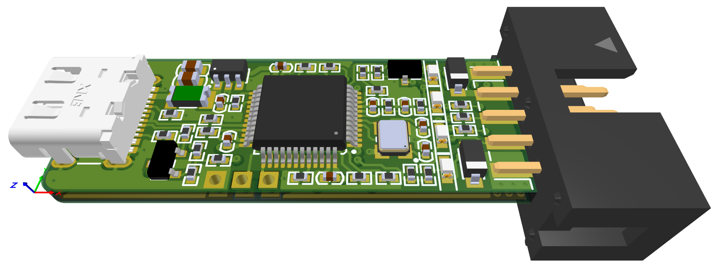
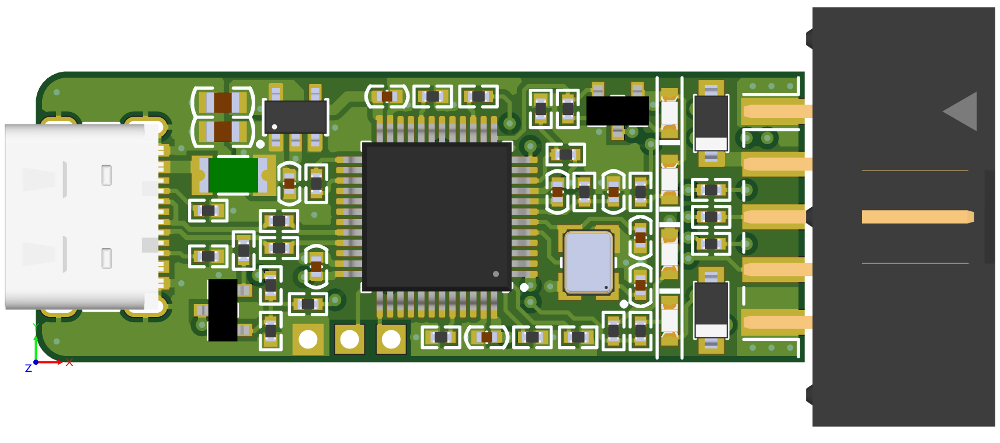
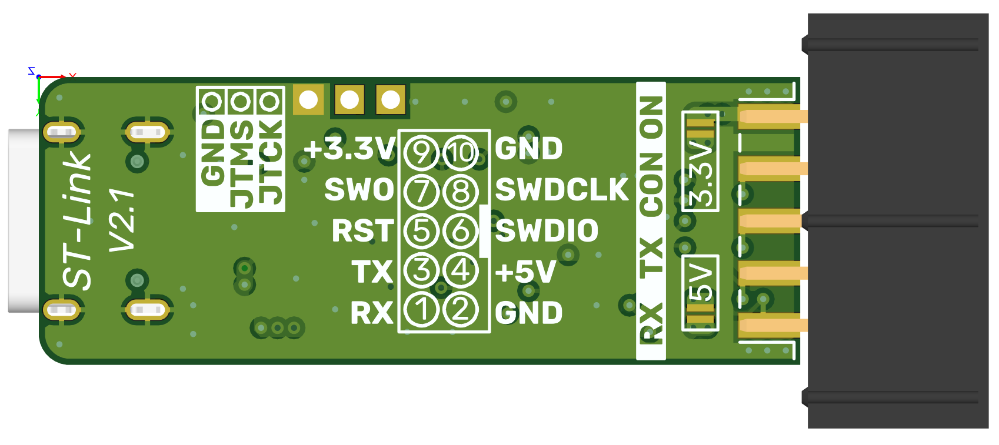
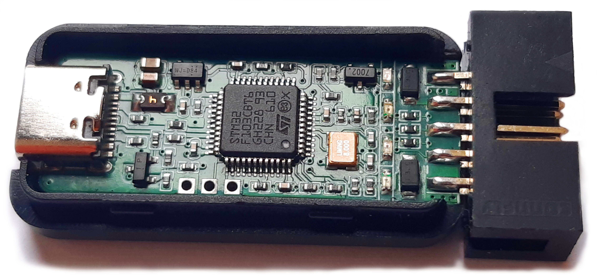
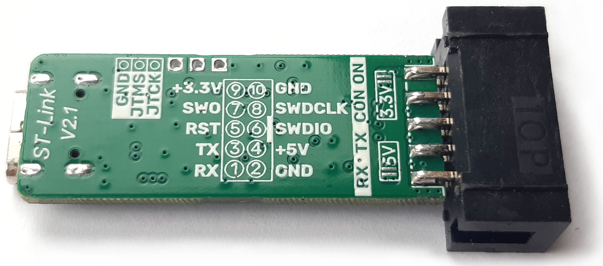
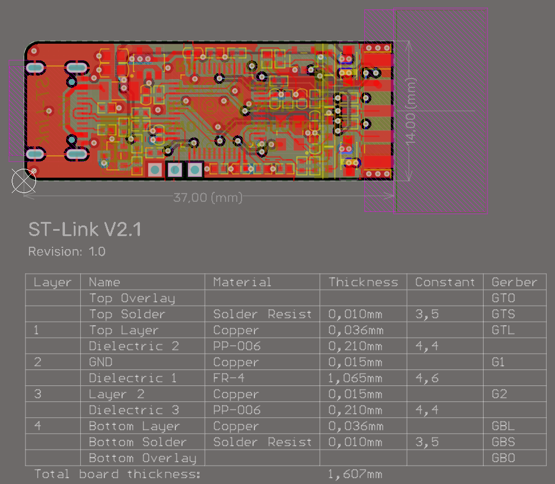

# ST-Link V2.1

  

  
  

 

 

  

  

Small version of ST-Link v2.1 (37mm x 14mm board)  
**Features**
  - SWD (Serial Wire Debug) - standard pins used for external targets include SWDIO, SWCLK, GND, and sometimes NRST.
  - Virtual COM Port (VCP)
  - USB Power Management: Supports requesting more than 100 mA from the host PC to power the application board.
  - SWO Support: Includes a Serial Wire Output (SWO) pin for real-time trace debugging, which is often missing on common "dongle" clones of the V2.

[Open](Draftsman_STLinkV2_1_rev1_0.pdf) - Some useful drawings

<a href="Draftsman_STLinkV2_1_rev1_0.pdf" target="_blank">`Draftsman_STLinkV2_1_rev1_0.pdf`</a>  - Some useful drawings

`Draftsman_STLinkV2_1_rev1_0.pdf` - Some useful drawings

`Schematic_STLinkV2_1_rev1_0.pdf` - Schematic

`Project/` - Project files

`Gerber/STLinkV2_1_rev1_0.zip` - Gerber files

## Stackup
The stack parameters for proper USB port operation are as follows:

  

 

This is the default stackup of one of those Chinese factories.
